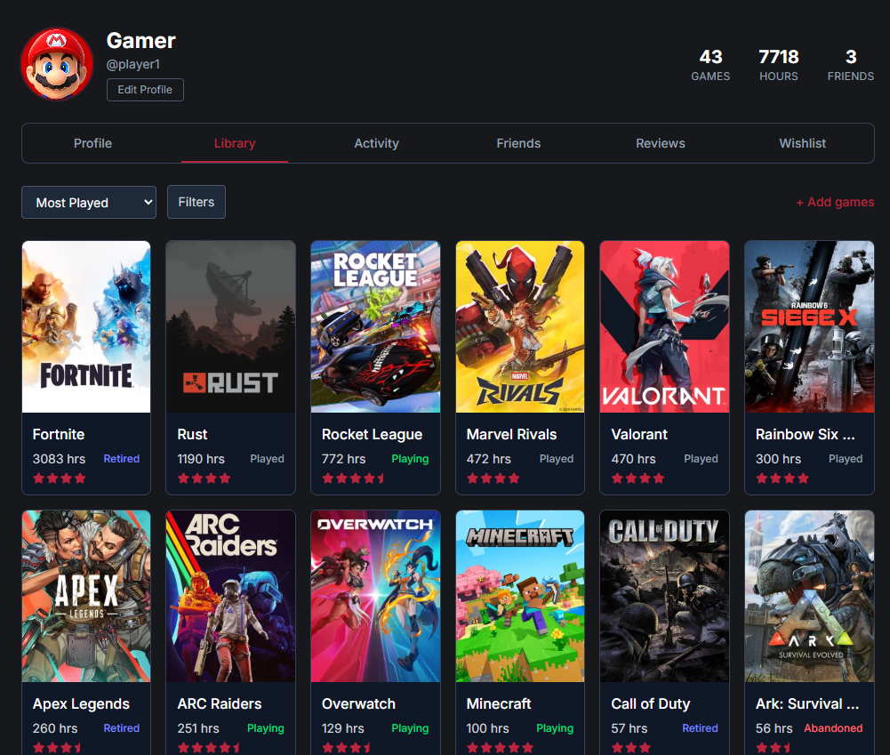
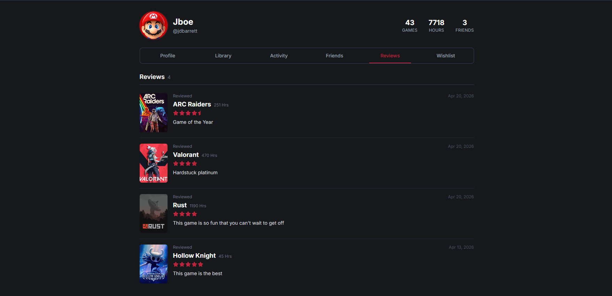
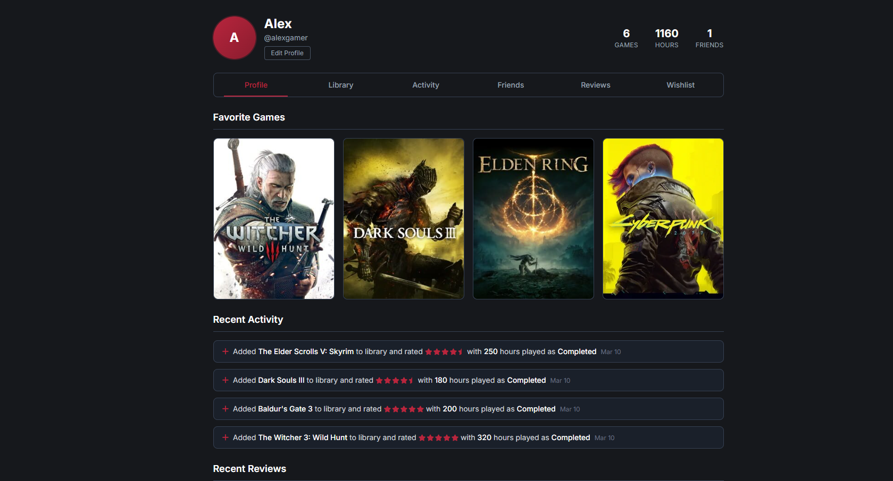
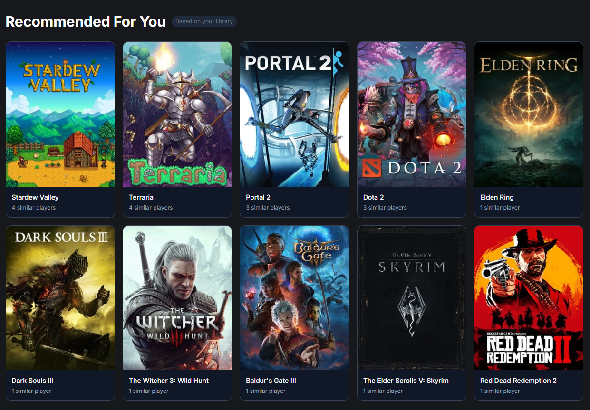

<picture>
  <source media="(prefers-color-scheme: dark)" srcset="public/icon-dark.svg">
  
</picture>

# Crucidex

**Track your gaming history. Build your library. Connect with friends.**

A social platform for cataloging the games you've played, sharing reviews, and discovering new titles based on what players with similar taste enjoy.

[Live Site](https://www.crucidex.com)

<br clear="left" />

---

## What is Crucidex?

Crucidex is a Letterboxd-style social network for video games. Index your personal collection, track playtime and ratings, write reviews, follow friends to see what they're playing, and get recommendations driven by collaborative filtering.

It's built as a full-stack web application — Next.js on the front, Supabase (Postgres) on the back, with deep integrations to **IGDB** for game metadata and **Steam** for automatic library imports.

---

## Features

### Index Your Personal Game Collection


Seamlessly import your Steam library and organize all your games in one place. Track playtime, ratings, and play status (Playing, Completed, Backlog, Shelved, Retired, Abandoned). Filter and sort across hours played, genres, game modes, and personal ratings.

### Share Your Experience With Reviews


Express your thoughts with detailed reviews. Build your gaming profile and become a trusted voice in the community.

### Stay Caught Up With Your Friends


Send mutual friend requests, build your friends list, and watch live activity feeds — game additions, reviews, status changes, and playtime milestones — all in real time.

### Receive Recommendations Based On Your Taste


A hybrid recommendation engine that blends **collaborative filtering** (Jaccard similarity + rating alignment) with **genre-based fallbacks** for cold-start users. Mark games as "Not Interested" to permanently filter them out and have a fresh suggestion swap in.

---

## Tech Stack

| Layer | Tech |
|---|---|
| Frontend | Next.js 16 (App Router), React 19, TypeScript |
| Styling | Tailwind CSS v4 |
| Backend / DB | Supabase (Postgres + Auth + Storage + RLS) |
| Game Data | IGDB API (via Twitch OAuth) |
| Steam Integration | Steam Web API + OpenID 2.0 |
| Email | Resend (custom SMTP) |
| Hosting | Vercel |

---

## Architecture Highlights

A few of the more interesting engineering problems solved along the way:

### Hybrid Recommendation Engine
Collaborative filtering by similar users (Jaccard similarity weighted 70%, rating alignment 30%) is supplemented with a genre-based fallback for users with thin libraries. Recommendations are **cached per user with a 24-hour TTL**, invalidated on any library mutation. When a user dismisses a recommendation, the system records the dismissal in `recommendation_dismissals` and computes a fresh replacement on demand — with optimistic UI updates and a synchronous request queue to prevent duplicate replacements during rapid-fire dismissals.

### Activity Log via Postgres Triggers
Rather than emit activity events from application code (easy to miss), the activity feed is built on **database-level triggers** on `user_games` and `reviews`. Triggers fire on INSERT/UPDATE/DELETE and write structured events to an `activity_log` table with JSONB metadata. This means even Steam re-imports that update playtime (no app code involved) automatically generate "Logged X hours on Y" entries. The feed reads from a single source of truth.

### Steam Auto-Import with Smart Matching
Steam library import resolves Steam App IDs to IGDB games via a multi-stage matching pipeline: external_games lookup → name search with year disambiguation → bundle/edition keyword filtering → strip-suffix retry. Edge cases (e.g., Valve's *Deadlock* beta sharing a name with an older game) can be permanently fixed by manually setting `steam_app_id` on the correct row in the `games` table — the import short-circuits to that row before ever hitting IGDB.

### Two-Step Email Confirmation
Standard one-click email verification was failing for many users because corporate email scanners (Gmail, Outlook, antivirus) pre-fetch every link in an email — consuming the one-time OTP before the user can click it. Solved by routing the verification link to a Next.js page with a "Confirm" button; scanners can GET the page freely without consuming the token, and only an actual user click triggers `verifyOtp`. **BroadcastChannel** is then used to notify the original signup tab that verification succeeded, so the user is logged in seamlessly without switching tabs.

### Layout-Based Tab Persistence
Profile pages (`/u/[username]/{profile,library,activity,friends,reviews,wishlist}`) share a layout that fetches profile data once via React Context. Switching between tabs only re-renders the content area — the avatar, stats, and nav bar persist across navigation. Tab-specific data fetches happen in parallel with each tab's render.

### Row-Level Security Throughout
Every user-facing table (profiles, user_games, reviews, friendships, recommendation_dismissals, etc.) has RLS policies that scope data access to the authenticated user. The browser-facing anon key cannot access another user's private data — the database enforces it.

---

## Local Development

```bash
# Clone and install
git clone https://github.com/jess-barrett/crucidex.git
cd crucidex
npm install

# Configure environment
cp .env.example .env.local
# Fill in:
#   NEXT_PUBLIC_SUPABASE_URL
#   NEXT_PUBLIC_SUPABASE_ANON_KEY
#   SUPABASE_SERVICE_ROLE_KEY
#   TWITCH_CLIENT_ID         (for IGDB)
#   TWITCH_CLIENT_SECRET
#   STEAM_API_KEY
#   NEXT_PUBLIC_SITE_URL     (e.g. http://localhost:3000)

# Set up the database
# Run the SQL files in your Supabase SQL editor in this order:
#   1. SEED_DATA.sql              (optional — adds 15 fake users + 20 games)
#   2. REVIEWS_TABLE.sql
#   3. FRIENDSHIPS_TABLE.sql
#   4. ACTIVITY_LOG_TABLE.sql
#   5. NOT_INTERESTED_TABLE.sql

# Run dev server
npm run dev
```

Open [http://localhost:3000](http://localhost:3000).

---

## Project Structure

```
app/
├── api/                    # Server-side API routes
│   ├── recommendations/    # Hybrid recommendation engine + dismissals
│   ├── activity/           # Activity feed reader
│   ├── friends/            # Mutual friendship CRUD
│   ├── steam/              # Steam OAuth + library import
│   └── games/search/       # IGDB-backed game search
├── auth/                   # Auth callback + email confirmation pages
├── components/             # Shared React components
├── games/[igdb_id]/        # Per-game detail page
├── u/[username]/           # User profile pages (layout-based tabs)
└── settings/               # User settings (profile, Steam linking, avatar)
lib/
├── supabase-{client,server}.ts
├── igdb.ts                 # IGDB API helpers + Steam-to-IGDB matching
├── game-stats.ts           # Aggregate game stats helpers
└── profile-layout-context.tsx  # Shared profile layout state
```

---

## Roadmap

Active areas of development:

- Public activity feed showing friends' recent activity on the dashboard
- Game-detail pages with friends-who-played + comparison views
- Like/comment on reviews
- Aggregated game stats (community rating distributions, average playtime)
- Mobile responsive polish

---

## Author

Built by [Jess Barrett](https://github.com/jess-barrett).

